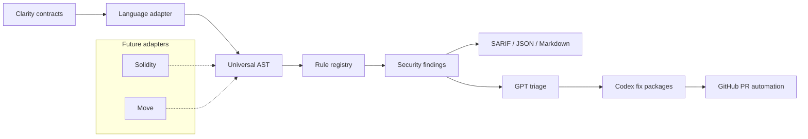

# SentinelClarity

[](https://github.com/wolfieexd/SentinelClarity-AI/actions/workflows/ci.yml)
[](LICENSE)
[](Cargo.toml)
[](artifacts/sentinel-results.sarif)
[](https://github.com/wolfieexd/SentinelClarity-AI)



SentinelClarity is an AI-native security engineering platform for Clarity smart contracts. It is designed to scan Bitcoin-layer smart contract repositories continuously, explain findings with senior-auditor context, and prepare minimal fixes that can be reviewed and merged through a GitHub-native workflow.

The project starts with Clarity and Stacks, but the core architecture is intentionally language-agnostic: parsers convert source code into a shared Universal AST, security rules run against that representation, and downstream outputs can flow into SARIF, markdown reports, AI triage, and pull request automation.

## Why SentinelClarity

Smart contract teams need fast feedback before vulnerable code reaches mainnet. Traditional audits are essential, but they are periodic, expensive, and difficult to fit into every pull request. SentinelClarity brings security review closer to the development loop by combining deterministic static analysis with structured AI reasoning and reviewable automated fixes.

The long-term goal is a continuous security engineer for Clarity contracts:

- Parse Clarity contracts into a typed, language-neutral intermediate representation.
- Run focused security rules for common exploit classes and protocol mistakes.
- Produce SARIF for GitHub code scanning and markdown for developer review.
- Triage findings with exploitability, blast radius, root cause, and fix strategy.
- Generate small, test-backed remediation pull requests for approved findings.
- Preserve a clean path to future Solidity, Move, or other smart contract adapters.

## Current Status

This repository is in Sprint 3 of the OpenAI Build Week implementation plan. The workspace scaffold, lightweight Clarity adapter, rule registry, six heuristic security rules, CLI file scanning, handcrafted corpus fixtures, rule documentation, offline triage engine, fix-package templates, config validation, shell completions, and demo script are in place. Full parser-backed type analysis, live OpenAI API integration, mainnet corpus expansion, and PR automation remain future hardening work.

| Area | Status |
| --- | --- |
| Rust workspace | Scaffolded |
| Universal AST and traits | Implemented foundation |
| SARIF model | Scaffolded |
| Clarity adapter | Lightweight function and operation extraction |
| Rule engine | Six heuristic rules registered |
| CLI | Scans `.clar` files, validates config, and generates completions |
| GitHub Action | Template scaffolded |
| AI triage and fixes | Offline triage engine and fix templates |
| Test corpus | Handcrafted, demo, and regression fixtures |

For a precise capability matrix, see `PROJECT_STATUS.md`.

## Repository Layout

```text
sentinel-clarity/
|-- sentinel-core/         # Universal AST, traits, findings, SARIF primitives
|-- sentinel-clarity/      # Clarity language adapter
|-- sentinel-engine/       # Rule registry and scanner orchestration
|-- sentinel-ai/           # Triage result types and Codex fix generator interface
|-- sentinel-cli/          # CLI entrypoint and command surface
|-- sentinel-action/       # GitHub Action wrapper metadata
|-- sentinel-test-corpus/  # Contract corpus and expected finding fixtures
|-- docs/                  # ADRs and rule documentation
|-- artifacts/             # Demo reports, SARIF, screenshots, and fix plans
`-- sentinel.toml          # Default scanner configuration
```

## Architecture



### Core Interfaces

SentinelClarity is organized around three extension points:

- `LanguageAdapter`: parses source code and converts it into the Universal AST.
- `SecurityRule`: inspects the Universal AST and emits normalized findings.
- `FixGenerator`: prepares remediation packages from findings and triage context.

This keeps parser work, rule logic, AI triage, and delivery automation independent enough to evolve quickly during the hackathon.

## CLI

The CLI binary is named `sentinel-clarity`.

```bash
cargo run --package sentinel-cli -- scan . --format sarif
cargo run --package sentinel-cli -- scan ./contracts --format markdown
cargo run --package sentinel-cli -- scan ./contracts --format markdown --triage
cargo run --package sentinel-cli -- init
cargo run --package sentinel-cli -- init --validate --config sentinel.toml
cargo run --package sentinel-cli -- completions powershell
cargo run --package sentinel-cli -- test-corpus --all
```

## Judge Quickstart

Run the full demo flow in under two minutes:

```bash
git clone https://github.com/wolfieexd/SentinelClarity-AI.git
cd SentinelClarity-AI
./scripts/judge-demo.sh
```

The demo target is `sentinel-test-corpus/contracts/demo/vulnerable-dao.clar`, a deliberately vulnerable DAO treasury contract with access-control, arithmetic, unchecked-call, reentrancy, and read-only mutation findings.

Manual equivalent:

```bash
cargo test --workspace
cargo run --package sentinel-cli -- init --validate --config sentinel.toml
cargo run --package sentinel-cli -- scan sentinel-test-corpus/contracts/demo/vulnerable-dao.clar --format markdown --triage --fail-on critical
```

Planned production commands:

| Command | Purpose |
| --- | --- |
| `scan [PATH]` | Scan Clarity contracts and emit SARIF, JSON, or markdown |
| `init` | Print a default `sentinel.toml` or validate an existing config |
| `completions <SHELL>` | Generate shell completions for Bash, Zsh, Fish, PowerShell, or Elvish |
| `test-corpus` | Run curated contract fixtures against expected findings |
| `serve` | Start an HTTP API for editor and IDE integration |
| `version` | Print the CLI version |

## Configuration

SentinelClarity uses `sentinel.toml` for scanner behavior, AI settings, and output policy.

```toml
[rules]
SC-REENTRANCY = { enabled = true, severity = "critical" }
SC-ACCESS = { enabled = true, severity = "high" }
SC-OVERFLOW = { enabled = true, severity = "high" }
SC-UNCHECKED = { enabled = true, severity = "medium" }
SC-TRAIT = { enabled = true, severity = "medium" }
SC-READONLY = { enabled = true, severity = "high" }

[ai]
model = "gpt-5.6"
triage_enabled = true
fix_enabled = false
context_lines = 30
max_context_tokens = 4000

[output]
formats = ["sarif", "markdown", "json"]
annotate_pr = true
fail_on_severity = "high"
```

## Rule Roadmap

| Rule | Focus | Default Severity |
| --- | --- | --- |
| `SC-REENTRANCY` | External calls before state changes | Critical |
| `SC-ACCESS` | Missing owner or caller authorization | High |
| `SC-OVERFLOW` | Unsafe arithmetic and unchecked operations | High |
| `SC-UNCHECKED` | Unhandled external call responses | Medium |
| `SC-TRAIT` | Trait implementation and signature mismatches | Medium |
| `SC-READONLY` | State mutation from read-only functions | High |

Each Sprint 1 rule ships with handcrafted vulnerable and fixed fixtures plus documentation under `docs/rules/`. Parser-backed precision and larger real-world corpus coverage are planned next.

## GitHub Action

The repository includes a starter workflow at `.github/workflows/sentinel-clarity.yml`.

The intended workflow is:

1. Build or download the `sentinel-clarity` binary.
2. Scan changed `.clar` files.
3. Upload SARIF through GitHub code scanning.
4. Post a pull request summary.
5. In later sprints, open annotated fix PRs and verify fixes with a re-scan.

Example workflow usage:

```yaml
name: SentinelClarity

on:
  pull_request:
    paths:
      - "**/*.clar"

jobs:
  scan:
    runs-on: ubuntu-latest
    steps:
      - uses: actions/checkout@v4
      - uses: ./sentinel-action
        with:
          path: "."
          format: "sarif"
          fail-on: "high"
```

## AI Triage

Sprint 2 adds a deterministic triage engine that mirrors the planned structured AI response shape without requiring network credentials during CI.

For each finding, triage produces:

- Exploitability classification
- Blast radius
- Root cause
- Fix strategy
- Confidence score
- Developer-facing explanation
- References
- Optional fix package plan

Run triage locally with:

```bash
cargo run --package sentinel-cli -- scan sentinel-test-corpus/contracts --format markdown --triage
```

The current implementation uses `HeuristicTriageClient` behind the `TriageClient` trait. A live OpenAI client can be added behind that interface without changing scanner output contracts.

## How AI Is Used

SentinelClarity is AI-native, but the current repository intentionally keeps CI deterministic and credential-free:

| Layer | Current Implementation | Production Direction |
| --- | --- | --- |
| Finding schema | Static rules emit normalized findings | Keep as the stable contract for AI and SARIF |
| Triage | Offline `HeuristicTriageClient` | Live OpenAI structured-output triage behind `TriageClient` |
| Fix planning | Codex-style fix package templates | Apply patches in branches and open reviewable PRs |
| Human control | Reports and fix plans only | Approval-gated automated remediation |

This design makes the demo reproducible while preserving a clean seam for OpenAI-backed reasoning.

## Limitations

SentinelClarity is a polished hackathon MVP, not a complete audit replacement.

- The Clarity adapter is lightweight and heuristic, not a compiler-grade parser.
- Rules prioritize explainable signal over full semantic/dataflow precision.
- Live OpenAI API triage is not connected yet; offline triage mirrors the planned response shape.
- PR automation is represented by fix-package templates and a mock remediation plan.
- The corpus includes handcrafted, demo, and regression fixtures, but not a large labeled mainnet dataset.
- Findings should be reviewed by developers or auditors before production decisions.

## Comparison

| Approach | Strength | Gap SentinelClarity Targets |
| --- | --- | --- |
| Manual audit | Deep expert review | Too slow and expensive for every pull request |
| Generic linter | Fast syntax/style feedback | Usually lacks exploitability and remediation context |
| SARIF-only scanner | GitHub-native reporting | Does not explain blast radius or fix strategy |
| SentinelClarity | Static findings plus AI-style triage and fix plans | MVP still needs parser hardening and live PR automation |

## Development

Install Rust, then run:

```bash
cargo fmt --check
cargo clippy --workspace --all-targets -- -D warnings
cargo test --workspace
```

The current development environment used for the initial scaffold did not have `cargo` or `rustc` available on `PATH`, so local compile verification still needs to be run from a Rust-enabled shell.

## Demo

The repository includes a repeatable demo script for the current offline scanner and triage flow:

```bash
./scripts/judge-demo.sh
```

The demo validates `sentinel.toml`, scans the handcrafted corpus with AI-style markdown triage, and writes a SARIF report to `sentinel-results.sarif`.

### Demo Flow

1. Open `sentinel-test-corpus/contracts/demo/vulnerable-dao.clar`.
2. Run `sentinel-clarity scan` with `--triage`.
3. Review exploitability, blast radius, root cause, and fix strategy.
4. Compare against `sentinel-test-corpus/contracts/demo/fixed-dao.clar`.
5. Inspect `artifacts/fix-plan.md` as the mock PR body.
6. Upload or inspect `artifacts/sentinel-results.sarif` for GitHub code-scanning style output.

### Demo Artifacts

| Artifact | Purpose |
| --- | --- |
| `artifacts/demo-output.md` | Sample AI triage report for the vulnerable DAO |
| `artifacts/demo-output.json` | Machine-readable demo triage summary |
| `artifacts/fix-plan.md` | Mock remediation PR body |
| `artifacts/sentinel-results.sarif` | Sample SARIF 2.1.0 output with source locations |
| `artifacts/screenshots/sentinel-demo.svg` | Animated terminal-style README demo |
| `artifacts/screenshots/README.md` | Screenshot and demo asset checklist for README and Devpost |

## Project Docs

| Document | Purpose |
| --- | --- |
| `SUBMISSION.md` | Devpost-ready project narrative |
| `PROJECT_STATUS.md` | Exact MVP capability and limitation matrix |
| `docs/architecture.md` | Mermaid architecture diagrams and implementation boundaries |
| `docs/demo-script.md` | 60-second judge walkthrough |
| `docs/threat-model.md` | Assets, adversaries, covered risks, and out-of-scope threats |
| `docs/adr/0001-architecture.md` | Architecture decision record |
| `docs/rules/` | Security rule catalog |

## What Makes This AI-Native

- Findings are normalized into a structured schema before triage.
- Each finding receives exploitability, blast radius, root cause, and fix strategy.
- Fix packages are generated as reviewable patch and test plans rather than silent rewrites.
- The `TriageClient` trait keeps offline CI deterministic while preserving a clean integration point for live OpenAI-backed triage.
- The architecture separates static analysis, reasoning, remediation planning, and delivery automation.

## Build Week Plan

| Sprint | Focus | Gate |
| --- | --- | --- |
| Sprint 0 | Inception, architecture, workspace scaffold | Repo structure, CI, ADR |
| Sprint 1 | Parser, rule engine, six security rules | Heuristic scanner, fixtures, docs |
| Sprint 2 | GPT triage, Codex fix generation, PR bot | Offline triage, fix templates, CLI output |
| Sprint 3 | Hardening, corpus, demo, submission | Demo, README, Devpost submission |
| Sprint 4 | Production hardening | Live OpenAI triage, parser precision, PR automation |

## Future Sprint 4

- Replace lightweight Clarity extraction with parser-backed semantic analysis.
- Connect `TriageClient` to live OpenAI structured outputs.
- Add approval-gated GitHub PR creation for generated fixes.
- Expand corpus with labeled mainnet contracts and fuzzed edge cases.
- Add before/after remediation verification that re-scans patched contracts.
- Expose the scanner through the `serve` API for IDE and editor integrations.

## Sprint Checklist

### Sprint 0 - Inception and Architecture

- [x] Create Rust workspace and crate layout.
- [x] Add core traits for language adapters, rules, and fix generation.
- [x] Add SARIF report scaffolding.
- [x] Add CLI, GitHub Action, and CI workflow skeletons.
- [x] Add default `sentinel.toml`, README, ADR, changelog, and session log.
- [x] Push Sprint 0 checkpoint to GitHub.

### Sprint 1 - Core Engine

- [x] Add lightweight Clarity function and operation extraction.
- [x] Implement rule registry and scanner orchestration.
- [x] Add six heuristic security rules.
- [x] Add markdown, JSON, and SARIF scan output paths.
- [x] Add handcrafted vulnerable and fixed corpus fixtures.
- [x] Add rule documentation pages.
- [x] Keep CI green across Ubuntu, macOS, and Windows.
- [x] Push Sprint 1 checkpoint to GitHub.

### Sprint 2 - AI Pipeline

- [x] Add triage context builder.
- [x] Add `TriageClient` interface for future OpenAI-backed triage.
- [x] Add deterministic offline triage engine.
- [x] Add exploitability, blast radius, root cause, strategy, confidence, and references.
- [x] Add Codex fix-package templates for fixable rules.
- [x] Add `scan --triage --format markdown`.
- [x] Keep CI green across Ubuntu, macOS, and Windows.
- [x] Push Sprint 2 checkpoint to GitHub.

### Sprint 3 - Polish and Submission

- [x] Improve error UX and configuration validation.
- [x] Add demo DAO vulnerable and fixed contract pair.
- [x] Add sample demo report, SARIF, and mock PR fix plan artifacts.
- [x] Expand corpus coverage beyond handcrafted fixtures.
- [x] Add shell completion generation.
- [x] Prepare demo script and recording assets.
- [x] Finalize README judge quickstart and demo flow.
- [x] Add Devpost-ready `SUBMISSION.md`.
- [x] Add architecture diagrams.
- [x] Add release binary workflow.
- [x] Confirm all CI gates are green.
- [ ] Submit Devpost package.

## OpenAI Build Week 2026

- Track: Developer Tools
- Project: SentinelClarity
- Repository: `https://github.com/wolfieexd/SentinelClarity-AI`
- License: MIT
- Demo video: Add during Devpost submission
- Submission deadline: July 21, 2026 at 5:00 PM PT

## Topics

`clarity` `stacks` `smart-contract-security` `sarif` `rust` `ai-security` `developer-tools` `openai-build-week`

## License

SentinelClarity is released under the MIT License. See `LICENSE` for details.
