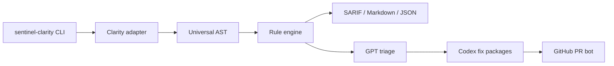

# SentinelClarity

AI-native continuous security engineering for Clarity smart contracts.

SentinelClarity is a Rust CLI and GitHub Action for parsing Clarity contracts, running security rules, producing SARIF, and preparing GPT-assisted triage and Codex-assisted fixes.

## Status

Sprint 0 scaffold is complete:

- Rust workspace with core, adapter, engine, AI, CLI, action, and corpus crates
- Universal AST, rule, adapter, SARIF, and fix-generation interfaces
- CLI commands: `scan`, `serve`, `init`, `test-corpus`, `version`
- GitHub CI and SentinelClarity action templates
- Config, ADR, contribution guide, changelog, and session log skeletons

## Quickstart

```bash
cargo test --workspace
cargo run --package sentinel-cli -- scan . --format sarif
cargo run --package sentinel-cli -- init
```

## Architecture



## Rule Catalog

| Rule | Focus | Sprint |
| --- | --- | --- |
| SC-REENTRANCY | External calls before state changes | 1 |
| SC-ACCESS | Missing owner or caller checks | 1 |
| SC-OVERFLOW | Unsafe arithmetic | 1 |
| SC-UNCHECKED | Unhandled response paths | 1 |
| SC-TRAIT | Trait implementation mismatches | 1 |
| SC-READONLY | State mutation in read-only functions | 1 |

## OpenAI Build Week 2026

- Track: Developer Tools
- Codex Session IDs: see `SESSIONS.md`
- Demo video: TBD
- Devpost: due July 21, 2026 at 5:00 PM PT
