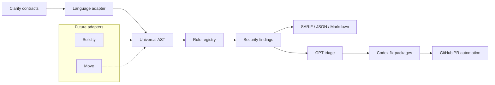

# SentinelClarity

[](https://github.com/wolfieexd/SentinelClarity-AI/actions/workflows/ci.yml)
[](LICENSE)
[](https://github.com/wolfieexd/SentinelClarity-AI)

SentinelClarity is an AI-native security engineering platform for Clarity smart contracts. It is designed to scan Bitcoin-layer smart contract repositories continuously, explain findings with senior-auditor context, and prepare minimal fixes that can be reviewed and merged through a GitHub-native workflow.

The project starts with Clarity and Stacks, but the core architecture is intentionally language-agnostic: parsers convert source code into a shared Universal AST, security rules run against that representation, and downstream outputs can flow into SARIF, markdown reports, AI triage, and pull request automation.

## Why SentinelClarity

Smart contract teams need fast feedback before vulnerable code reaches mainnet. Traditional audits are essential, but they are periodic, expensive, and difficult to fit into every pull request. SentinelClarity brings security review closer to the development loop by combining deterministic static analysis with structured AI reasoning and reviewable automated fixes.

The long-term goal is a continuous security engineer for Clarity contracts:

- Parse Clarity contracts into a typed, language-neutral intermediate representation.
- Run focused security rules for common exploit classes and protocol mistakes.
- Produce SARIF for GitHub code scanning and markdown for developer review.
- Triage findings with exploitability, blast radius, root cause, and fix strategy.
- Generate small, test-backed remediation pull requests for approved findings.
- Preserve a clean path to future Solidity, Move, or other smart contract adapters.

## Current Status

This repository is in Sprint 0 of the OpenAI Build Week implementation plan. The workspace scaffold, architecture boundaries, CI templates, configuration schema, and documentation skeleton are in place. Rule implementations, Clarity parsing depth, AI triage, and PR automation are planned for the next sprints.

| Area | Status |
| --- | --- |
| Rust workspace | Scaffolded |
| Universal AST and traits | Scaffolded |
| SARIF model | Scaffolded |
| Clarity adapter | Parser stub |
| Rule engine | Registry and scanner scaffold |
| CLI | Command surface scaffolded |
| GitHub Action | Template scaffolded |
| AI triage and fixes | Type scaffold |
| Test corpus | Crate scaffold |

## Repository Layout

```text
sentinel-clarity/
├── sentinel-core/         # Universal AST, traits, findings, SARIF primitives
├── sentinel-clarity/      # Clarity language adapter
├── sentinel-engine/       # Rule registry and scanner orchestration
├── sentinel-ai/           # Triage result types and Codex fix generator interface
├── sentinel-cli/          # CLI entrypoint and command surface
├── sentinel-action/       # GitHub Action wrapper metadata
├── sentinel-test-corpus/  # Contract corpus and expected finding fixtures
├── docs/                  # ADRs and rule documentation
└── sentinel.toml          # Default scanner configuration
```

## Architecture



### Core Interfaces

SentinelClarity is organized around three extension points:

- `LanguageAdapter`: parses source code and converts it into the Universal AST.
- `SecurityRule`: inspects the Universal AST and emits normalized findings.
- `FixGenerator`: prepares remediation packages from findings and triage context.

This keeps parser work, rule logic, AI triage, and delivery automation independent enough to evolve quickly during the hackathon.

## CLI

The CLI binary is named `sentinel-clarity`.

```bash
cargo run --package sentinel-cli -- scan . --format sarif
cargo run --package sentinel-cli -- scan ./contracts --format markdown
cargo run --package sentinel-cli -- init
cargo run --package sentinel-cli -- test-corpus --all
```

Planned production commands:

| Command | Purpose |
| --- | --- |
| `scan [PATH]` | Scan Clarity contracts and emit SARIF, JSON, or markdown |
| `init` | Print or create a default `sentinel.toml` |
| `test-corpus` | Run curated contract fixtures against expected findings |
| `serve` | Start an HTTP API for editor and IDE integration |
| `version` | Print the CLI version |

## Configuration

SentinelClarity uses `sentinel.toml` for scanner behavior, AI settings, and output policy.

```toml
[rules]
SC-REENTRANCY = { enabled = true, severity = "critical" }
SC-ACCESS = { enabled = true, severity = "high" }
SC-OVERFLOW = { enabled = true, severity = "high" }
SC-UNCHECKED = { enabled = true, severity = "medium" }
SC-TRAIT = { enabled = true, severity = "medium" }
SC-READONLY = { enabled = true, severity = "high" }

[ai]
model = "gpt-5.6"
triage_enabled = true
fix_enabled = false
context_lines = 30
max_context_tokens = 4000

[output]
formats = ["sarif", "markdown", "json"]
annotate_pr = true
fail_on_severity = "high"
```

## Rule Roadmap

| Rule | Focus | Default Severity |
| --- | --- | --- |
| `SC-REENTRANCY` | External calls before state changes | Critical |
| `SC-ACCESS` | Missing owner or caller authorization | High |
| `SC-OVERFLOW` | Unsafe arithmetic and unchecked operations | High |
| `SC-UNCHECKED` | Unhandled external call responses | Medium |
| `SC-TRAIT` | Trait implementation and signature mismatches | Medium |
| `SC-READONLY` | State mutation from read-only functions | High |

Each rule will ship with vulnerable and fixed fixtures, integration coverage, SARIF output checks, and documentation under `docs/rules/`.

## GitHub Action

The repository includes a starter workflow at `.github/workflows/sentinel-clarity.yml`.

The intended workflow is:

1. Build or download the `sentinel-clarity` binary.
2. Scan changed `.clar` files.
3. Upload SARIF through GitHub code scanning.
4. Post a pull request summary.
5. In later sprints, open annotated fix PRs and verify fixes with a re-scan.

## Development

Install Rust, then run:

```bash
cargo fmt --check
cargo clippy --workspace --all-targets -- -D warnings
cargo test --workspace
```

The current development environment used for the initial scaffold did not have `cargo` or `rustc` available on `PATH`, so local compile verification still needs to be run from a Rust-enabled shell.

## Build Week Plan

| Sprint | Focus | Gate |
| --- | --- | --- |
| Sprint 0 | Inception, architecture, workspace scaffold | Repo structure, CI, ADR |
| Sprint 1 | Parser, rule engine, six security rules | Green tests and valid SARIF |
| Sprint 2 | GPT triage, Codex fix generation, PR bot | End-to-end scan to fix PR |
| Sprint 3 | Hardening, corpus, demo, submission | Demo, README, Devpost submission |

## OpenAI Build Week 2026

- Track: Developer Tools
- Project: SentinelClarity
- Repository: `https://github.com/wolfieexd/SentinelClarity-AI`
- License: MIT
- Demo video: TBD
- Codex session log: `SESSIONS.md`
- Submission deadline: July 21, 2026 at 5:00 PM PT

## License

SentinelClarity is released under the MIT License. See `LICENSE` for details.
