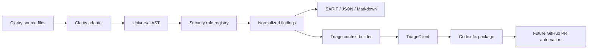
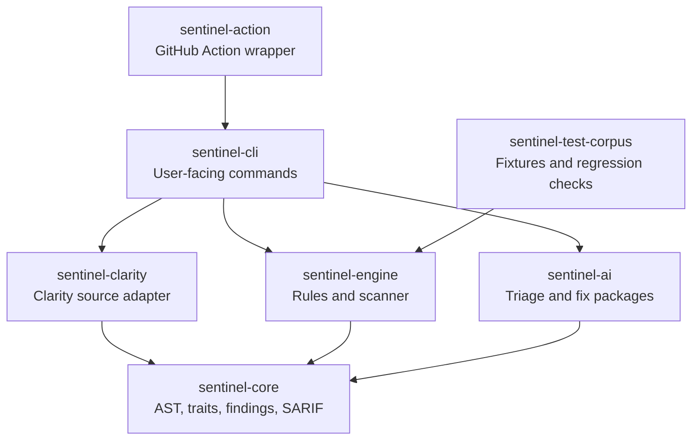
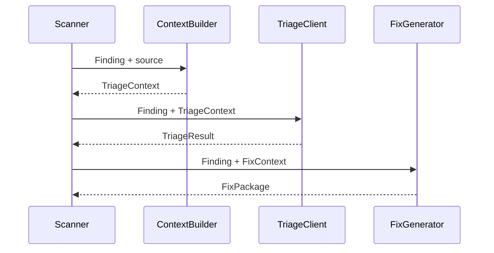

# SentinelClarity Architecture

SentinelClarity is organized as a pipeline: source code is adapted into a shared representation, deterministic rules emit findings, AI triage enriches those findings, and delivery layers publish results to developers.

## System Flow

## Crate Responsibilities

## Triage Contract

## Design Principles

- Keep static analysis deterministic and CI-safe.
- Keep AI output structured and reviewable.
- Prefer small fix packages over broad rewrites.
- Make SARIF useful for GitHub code scanning.
- Preserve a language-agnostic core for future adapters.

## Current Implementation Boundaries

The current Clarity adapter is intentionally lightweight. It extracts function boundaries, visibility, external calls, state operations, arithmetic markers, and read-only functions well enough for the Build Week demo.

Future parser-backed work should replace the heuristic extraction while keeping the `LanguageAdapter`, `SecurityRule`, and `TriageClient` contracts stable.
